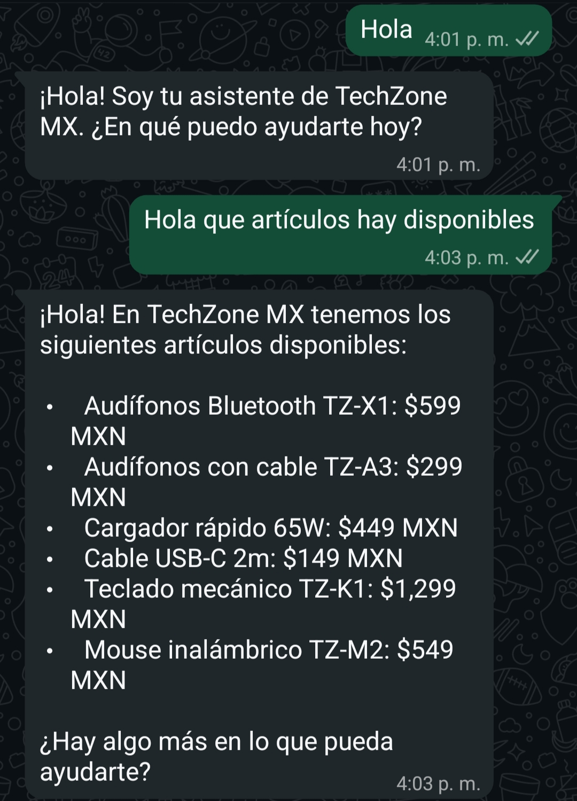
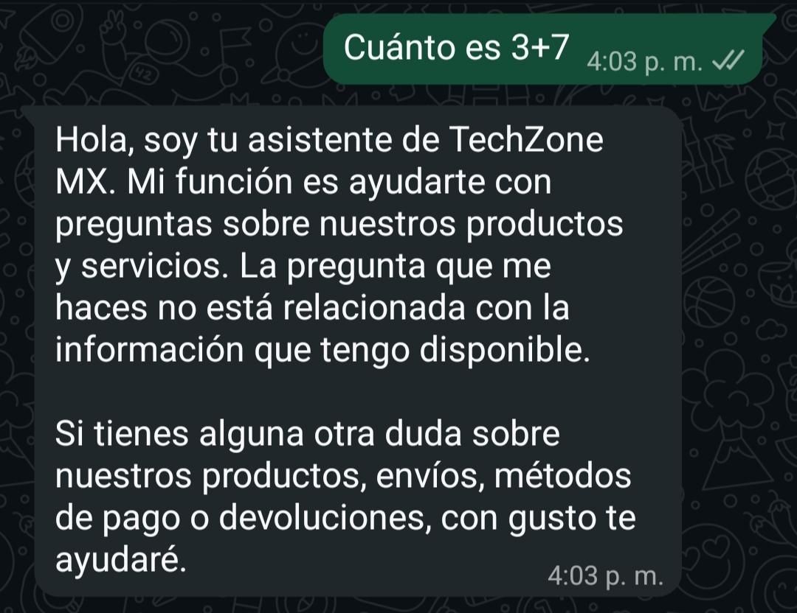

# WhatsApp Support Bot

Este es un proyecto pequeño en el cual se practica el uso de FastAPI, la API de Twilio y la API de Google para sus modelos de IA, integrando estas herramientas para un bot conectado a WhatsApp que contesta de acuerdo a un contexto dado. **(Proyecto DEMO)**


## Tecnologías
- Python
- FastAPI
- Twilio API
- Google AI (Gemma 4 26B A4B IT)
- Cloudflare Tunnel
- python-dotenv


## Requisitos previos
- Python 3.12+
- Cuenta de Twilio con sandbox de WhatsApp configurado
- API key de Google AI Studio
- Cloudflare Tunnel instalado


## Instalación

1. Clona el repositorio
```bash
git clone <url-del-repo>
cd whatsapp-support-bot
```

2. Crea y activa el entorno virtual
```bash
python -m venv venv
.\venv\Scripts\Activate.ps1
```

3. Instala las dependencias
```bash
pip install -r requirements.txt
```


## Variables de entorno

Crea un archivo `.env` en la raíz del proyecto con las siguientes variables:
    TWILIO_ACCOUNT_SID=tu_account_sid
    TWILIO_AUTH_TOKEN=tu_auth_token
    TWILIO_WHATSAPP_NUMBER=whatsapp:+14155238886
    GEMINI_API_KEY=tu_api_key


## Cómo correrlo

1. Levanta el servidor
```bash
uvicorn main:app --reload
```

2. Expón el servidor con Cloudflare Tunnel
```bash
cloudflared tunnel --url http://localhost:8000
```

3. Configura la URL generada por el tunnerl de cloudfared en Twilio Sandbox settings


## Arquitectura
Usuario (WhatsApp)
        ↓
API de Twilio
        ↓
Cloudflare Tunnel
        ↓
Servidor FastAPI (webhook)
        ↓
Google AI — Gemma 4
        ↓
Respuesta vía Twilio → Usuario


## Demo


